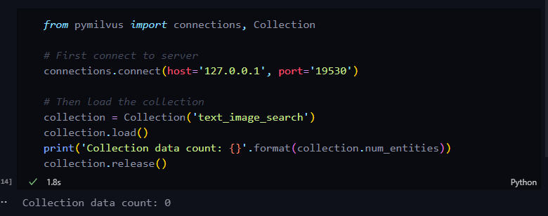
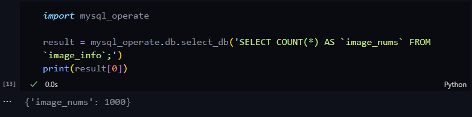
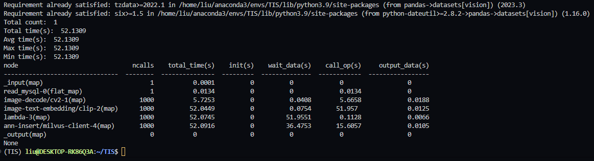
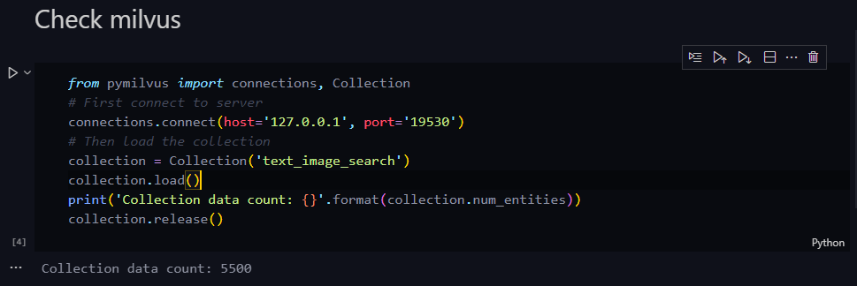
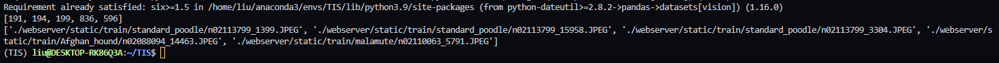
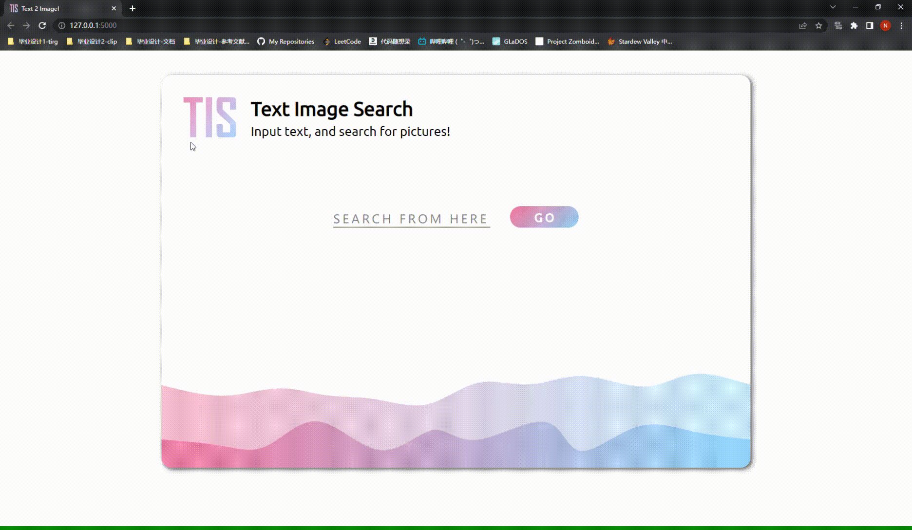

<!-- omit in toc -->
# **Readme.md**

<!-- omit in toc -->
## ***目录***

- [***介绍***](#介绍)
- [***如何运行？***](#如何运行)
  - [**检查环境**](#检查环境)
  - [**下载数据集**](#下载数据集)
  - [**在 Milvus 中创建 Collection**](#在-milvus-中创建-collection)
  - [**在 Mysql 中创建 Table 并插入图片信息（来源于csv文件）**](#在-mysql-中创建-table-并插入图片信息来源于csv文件)
  - [**使用 Towhee 将图片转化为向量并按 id 插入到 Milvus 中**](#使用-towhee-将图片转化为向量并按-id-插入到-milvus-中)
  - [**尝试检索**](#尝试检索)
  - [**运行 Demo**](#运行-demo)
- [***后记***](#后记)

## ***介绍***

这是一个用于实现“以文搜图”的Demo。数据集来源于ImageNet的一个子集，其中共有100个不同的类别，每个类别下有10张JPEG图片。项目使用mysql、milvus与towhee进行搭建；前端页面就潦草整了个html+css，后端用了一下python flask——随便吧，我也没学过咋写前后端哈哈，能用就行 :-)

## ***如何运行？***

### **检查环境**

-   确保运行环境不旧于下列所枚举的版本（最好一样，因为有太多奇怪的错误了）

    | Env/Pack Name |  Version  | Info | From |
    | -- | -- | -- | -- |
    | Python | 3.9 | - | Conda |
    | Mysql | 5.7 | - | Oracle官网有 |
    | Pymysql | 1.0.3 | Mysql的Python SDK | Pip |
    | Milvus | 2.0.2 | 向量数据库，基于 docker compose 快速构建 |  [Milvus doc](https://milvus.io/docs/v2.0.x/install_standalone-docker.md) |
    | Pymilvus | 2.0.2 | Milvus 的 Python SDK | Pip |
    | Towhee | 0.9.0 | 可以完成 x to vec 的框架工具 | Pip |
    | opencv-python |  4.7.0 | - | Pip |

> 如果你在环境中曾经使用 vscode 一键安装过 ipykernel 以运行 notebook，请检查 pygments 版本大于等于 2.13.0，或者在安装 ipykernel 的时候指定源为 ```conda-forge```。

```bash
conda install -c conda-forge ipykernel # 确认安装前检查 conda 将要安装的 pygments 版本
```
### **下载数据集**

-   下载数据集

    ```bash
    # 数据集链接以后补 :)
    ```

-   解压，得到的 train 文件夹放置于 ```webserver/static/``` 下，static文件结构如下：

    ```
    ├── static
    │   ├── TIS.png
    │   ├── Ubuntu-R-webfont.ttf
    │   ├── bottem_wave.png
    │   ├── style.css
    │   └── train
    │       ├── Afghan_hound
    │       │   ├── n02088094_1045.JPEG
    │       │   ├── n02088094_14463.JPEG
    │       │   ├── n02088094_2164.JPEG
    │       │   ├── n02088094_3882.JPEG
    │       │   ├── n02088094_5532.JPEG
    │       │   ├── n02088094_5911.JPEG
    │       │   ├── n02088094_6533.JPEG
    │       │   ├── n02088094_6565.JPEG
    │       │   ├── n02088094_7360.JPEG
    │       │   └── n02088094_9175.JPEG
    │       ├── African_crocodile
    │       │   ├── n01697457_10393.JPEG
    │       │   ├── ...
    ```

### **在 Milvus 中创建 Collection**

> Milvus作为一个向量数据库，很多专有术语与传统的数据库可以做个照应，比如 Mysql 中的一张表（Table）就对应 Milvus 中的一个 Collection。更多内容详见  [***Milvus Doc***](https://milvus.io/docs/v2.0.x/overview.md)

-   在根目录下运行以创建一个 Collection：

    ```bash
    python ./webserver/A_create_milvus_collection.py
    ```

    其中，被创建的 Collection 名为"text_image_search"，其结构为下表所示：
    | Field Name | Field Type | Dimension | Index Type | Index Parameters |
    | -- | -- | -- | -- | -- |
    | id | int64 | - | - | - |
    | embedding | FloatVector | 512 | IVF_FLAT | metric_type: L2, nlist: 512

-   打开 ```./webserver/tools.ipynb``` 并执行步骤 "Check Milvus" 来检查 Collection 是否成功创建：

    

    返回 0 意味着此时 Collection 中还没有 Entity，稍后将会插入图像的embedding。

### **在 Mysql 中创建 Table 并插入图片信息（来源于csv文件）**

-   在 ```./webserver/mysql_config.py``` 修改自己的 MySQL 信息以用于连接；

-   在根目录下运行以创建Table并插入图片信息：

    ```bash
    python ./webserver/B_create_mysql_database_and_insert.py
    ```

    其中，被创建的表名为 "image_info"，其结构为下表所示：
    | Name | Type | Length | Not NULL | Keys | Description |
    | -- | -- | -- | -- | -- | -- |
    | id | int | 64 | Yes | Primary Key | ids |
    | path | varchar | 255 | Yes | - | image paths |
    | label | varchar | 255 | Yes | - | image label, no used |

    此时可以在shell中看到插入内容的输出。打开 ```./webserver/tools.ipynb``` 并执行步骤 "Check Mysql" 来检查 Table 是否成功插入数据

    

### **使用 Towhee 将图片转化为向量并按 id 插入到 Milvus 中**

>   Towhee 是一个开源的 embedding 框架，通过使用 Towhee 提供的神经网络数据处理流水线(neural data processing pipeline)的方式，我们可以将 Towhee 社区中数百个现成的模型、算法组合为标准的 AI 流水线。本项目即使用了上述方法构造了两条“文本”到“图像”的embedding与搜索流水线。

-   在根目录下运行，以根据Mysql中存储的图片路径找到图片所在位置并输入到流水线，得到图片embedding并最后插入到我们刚刚新建的 Milvus Collection 中：

    ```bash
    python ./webserver/C_image_embedding_and_insert.py
    ```

    这个过程需要花费几分钟的时间。待执行完毕，可以在 shell 中看到 Towhee 执行各步骤的次数与用时。
    
    

    打开 ./webserver/tools.ipynb 并执行步骤 "Check Milvus" 来检查 Table 是否成功插入数据：

    

    可以看到现在 Collection 中已经有 1000 个实体，这说明图片的embedding已经被成功插入到 Milvus中，可以进行检索了。

    > 需要说明的是，无论采用哪种索引方式，Milvus 都是基于内存进行索引的。在索引加载到内存前（ <collection_name>.load() 方法，详见 ```./webserver/test.ipynb``` 的步骤 "Check Milvus" ）Milvus无法进行查询操作。

### **尝试检索**

>   我们可以使用 ```./webserver/D_search_pipeline.py``` 中的 **search()** 方法来进行检索。调用 **search()**，需要以一段文本作为输入，待检索完毕后会输出与文本描述最为接近的五张图片的 id 与图片的路径。
-   在 main 函数中修改变量 "input_text" 为你想要搜索的物品（e.g: A white dog; A comptuer, etc），并运行：

    ```bash
    python ./webserver/D_search_pipeline.py
    ```

    此时可以在 shell 中看到输出。第一个列表为图片的id，第二个列表为 id 对应的图片路径：

    

    你可以根据图片路径自行访问目录下文件以查看检索结果。

### **运行 Demo**

-   在目录 ```./webserver/``` 下运行命令以启动 flask 前后端：

    ```bash
    cd webserver
    flask run
    ```

-   在浏览器中访问 ```localhost:5000``` 以使用 TIS Demo：

    

## ***后记***

先空着，总有话要说的。